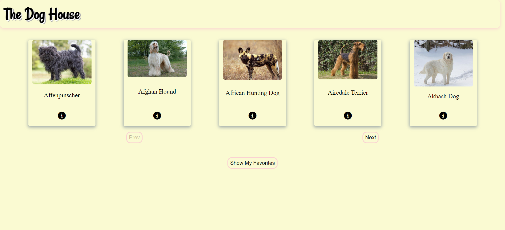

# The Dog House Application

This app uses a **public** API from [TheDogAPI](https://thedogapi.com/) to get information on various dogs. Information like:

-   breed of a dog.
-   name of the dog.
-   size of the dog.
-   a dog's temperament.
-   life expectancy of a dog.

## Purpose of the app

It is a solution for any user who is looking to get information on a variety of dog breeds that is curated in one application.

It aims to make their search and experience more informative and a lot smoother.

## Features and flow

On page load, a list of 5 dog data objects is gotten. Their names, images and a _more information_ icon are displayed.

The list of dog data objects is paginated. Clicking on the _next_ and _previous_ buttons moves through the paginated list.

Clicking on one of the information icons, provides more information about the specific dog. A user can add a particular dog's data to their list of favorites. This can be achieved by clicking on the _heart_ icon provided.

A user's favorites can then be displayed at the bottom of the page when the _show my favorites_ button is clicked.

A previously added favorite can be removed from the list by either:

-   clicking on the _remove_ buttons available on the favorites list or
-   clicking on the _heart_ icon again.

Interactions with the public API are done using the JavaScript **fetch** API.

### Language

JavaScript.

## Landing Page Preview

This is what the application's landing page looks like.

<>
